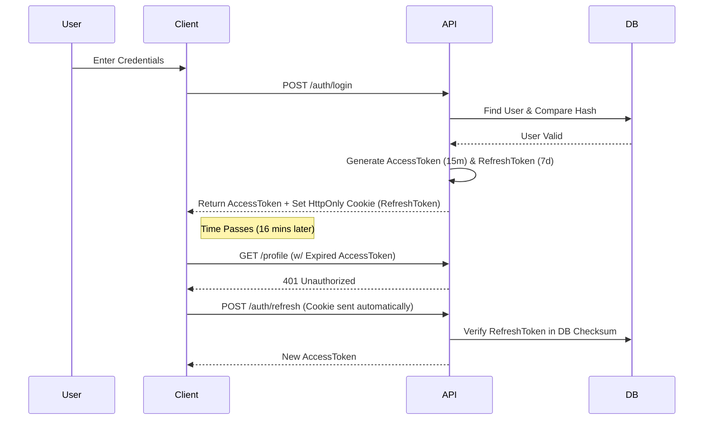
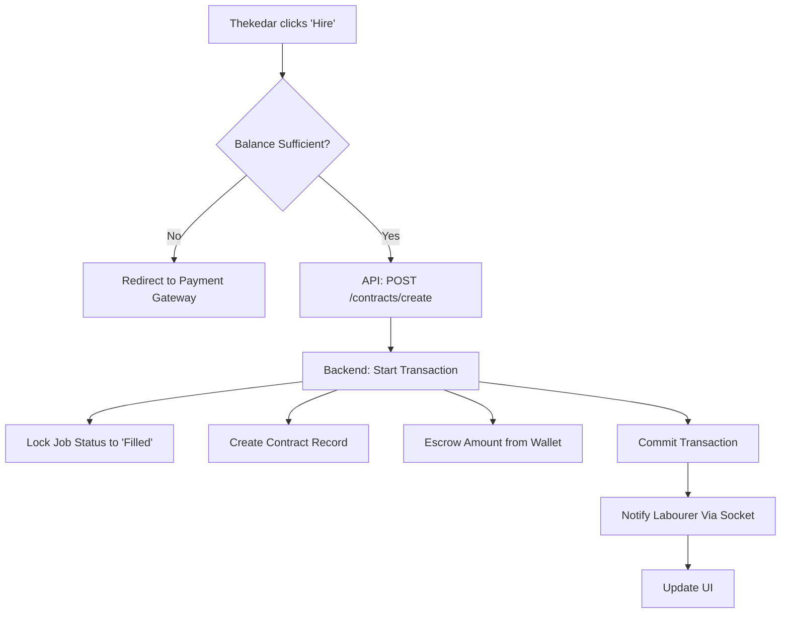

# 🏗️ KAAMSETU (MAJDOOR) - ARCHITECTURAL BLUEPRINT
> **Version:** 5.1 (Interview Ready)
> **Role:** Principal Architect Documentation
> **Target Audience:** Engineering Team & Interview Panel

---

# 🧠 1️⃣ MIND GRAPH / KNOWLEDGE MAP
## "The Nervous System of KaamSetu"

```text
KAAMSETU (Labour Platform)
 ├── 📱 Frontend (Client Layer)
 │   ├── 👤 Auth Interfaces (Login/Register/OTP)
 │   │   ├── Validation logic (Formik/Yup)
 │   │   └── State mgmt (Redux Auth Slice)
 │   ├── 👨‍🏭 Labour Dashboard (Job Search, Check-in, Wallet)
 │   │   ├── Geolocation polling
 │   │   └── WebSocket (Socket.io) for real-time alerts
 │   ├── 👷 Thekedar Dashboard (Post Jobs, Manage Crew, Payroll)
 │   │   ├── Interactive Map (Leaflet/Google Maps)
 │   │   └── Payment Gateway Integration (Razorpay/Stripe)
 │   ├── 🛡️ Admin/Verification (KYC, dispute resolution)
 │   └── 🔌 API Connector (Axios/Interceptors)
 │
 ├── 🖥️ Backend (Logic Layer)
 │   ├── 🔐 Auth Core (JWT, BCrypt, RBAC)
 │   │   ├── Access/Refresh Token rotation
 │   │   └── Session revocation blacklist
 │   ├── 🤝 Matching Engine (Algorithms, Geolocation)
 │   │   ├── Geospatial queries ($near, $geoWithin)
 │   │   └── Scoring metric (Distance + Rating + Skills)
 │   ├── 💰 Financials (Contracts, Payments, Payroll)
 │   │   ├── ACID Transactions for Ledger
 │   │   └── Double-entry bookkeeping logic
 │   ├── 🚧 Site Management (Attendance, QR Codes)
 │   ├── 🤖 Background Services (Cron Jobs)
 │   │   ├── Daily automated payouts
 │   │   └── Subscription expiration checks
 │   └── ☁️ Storage (Multer -> Local/S3)
 │
 ├── 🗄️ Database (Persistence - MongoDB)
 │   ├── 👥 Users (Labourers, Contractors) - Indexed by Phone, Geo
 │   ├── 📋 Jobs & Bids (Transactional) - State Machine
 │   ├── 📜 Contracts (Legally binding states)
 │   └── 💸 Ledger (Wallets, Transactions) - Immutable Logs
 │
 └── 🚀 Operations (DevOps)
     ├── 🔄 CI/CD (GitHub Actions)
     ├── ☁️ Cloud (Render/AWS)
     ├── 🛡️ Security (Helmet, RateLimit, XSS, HPP)
     └── 📊 Monitoring (Morgan, Winston, Sentry)
```

**Node Explanation:**
- **Frontend State:** Used Redux Toolkit to prevent prop-drilling in deep widget trees (e.g., Wallet Balance updating when a job is finished).
- **Matching Engine:** Decoupled from the main API. Can be spun out as a microservice if load increases.
- **Ledger:** Designed as an "Append Only" log system. We never overwrite a transaction balance; we only add new credit/debit entries.

---

# 📊 2️⃣ SYSTEM & BLOCK DIAGRAMS

## A) High-Level Architecture (The 10,000ft View)
```mermaid
graph TD
    Client[📱 Client App (Web/Mobile)]
    LB[⚖️ Load Balancer / Nginx]
    
    subgraph "API Cluster (Node.js)"
        API1[🖥️ API Instance 1]
        API2[🖥️ API Instance 2]
        API3[🖥️ API Instance 3]
    end
    
    subgraph "Data Persistence"
        Redis[(⚡ Redis Cache)]
        DB[(🗄️ MongoDB Primary)]
        DB_Replica[(🗄️ MongoDB Replica)]
    end
    
    subgraph "External Services"
        S3[☁️ AWS S3 (Images)]
        SMS[💬 SMS Gateway (Twilio)]
        Pay[💳 Payment Gateway]
    end

    Client -->|HTTPS/JSON| LB
    LB --> API1 & API2 & API3
    API1 -->|Read Profile| Redis
    Redis -.->|Miss| DB
    API1 -->|Write| DB
    DB -->|Replicate| DB_Replica
    API1 -->|Store Doc| S3
    API1 -->|Send OTP| SMS
```

## B) Authentication Flow (JWT + Refresh Token)


## C) Feature Execution: "Thekedar Hires Labourer"


---

# ⚙️ 3️⃣ CORE TECHNOLOGY STACK
## "Rationale for Production Choices"

### 🎨 Frontend: React 19 + Redux Toolkit
- **Why?** React 19 minimizes re-renders with the new Compiler, essential for low-end devices often used by our target demographic (Labourers).
- **Why Redux Toolkit?** We handle complex synchronous global state: `User Profile` + `Wallet Balance` + `Active Bids` + `GPS Location`. Context API triggers too many re-renders. RTK is efficient.
- **Alternatives Considered:**
  - *Next.js:* Good for SEO, but we are building a closed platform (Dashboard) where SEO matters less than app-like interactivity.
  - *Vue:* Easier curve, but React ecosystem (ecosystem for Maps, Payments) is richer.

### 🖥️ Backend: Node.js + Express 5
- **Why Node?** Validating GeoJSON data is CPU light but IO heavy. Node's Event Loop handles thousands of concurrent location pings better than threaded Python/Ruby.
- **Why Express 5?** Native Promise support in routing. Removes the need for `asyncHandler` wrappers or `try-catch` hell in every controller.
- **Alternatives Considered:**
  - *Go (Golang):* Better raw performance, but development speed is slower. We needed rapid iteration.
  - *NestJS:* Too much boilerplate for an MVP. Express is unopinionated and fast to set up.

### 🗄️ Database: MongoDB (Mongoose)
- **Why NoSQL?**
  1.  **Polymorphism:** A `User` can be a Labourer (Skills, Rating) or Thekedar (Company Name, GST). Single collection with flexible schema handles this best.
  2.  **Geospatial:** MongoDB's `$near` operator is industry standard for location queries.
- **Why Mongoose?**
  - Validation: We need to ensure `walletBalance` never drops below 0 via schema validators (`min: 0`).
  - Relationships: Virtual populate allows us to link `Bids` to `Jobs` without complex SQL joins.

### 🔐 Security & Infra
- **Files:** `Multer` streams files to disk/cloud. We check magic numbers (file signatures) to prevent spoofed executables being uploaded as `.jpg`.
- **API Security:**
  - `Helmet`: Sets HTTP headers (Strict-Transport-Security, X-Frame-Options).
  - `HPP`: Prevents HTTP Parameter Pollution (e.g. `?id=1&id=2` attacks).
  - `RateLimit`: 100 req/15min per IP.

---

# 📁 4️⃣ COMPLETE FILE & FOLDER STRUCTURE

```text
/labour-platform
├── /backend
│   ├── package.json     # Deps: express, mongoose, bcryptjs, jsonwebtoken
│   ├── server.js        # Entry point, Middleware registration, DB Connect
│   ├── /config
│   │   └── db.js        # Mongoose connection logic with retry strategy
│   ├── /controllers     # 🧠 Controller Logic (Req -> Business Logic -> Res)
│   │   ├── authController.js    # Login, Register, Refresh
│   │   ├── jobController.js     # CRUD Jobs, GeoSearch
│   │   └── paymentController.js # Wallet logic, Gateway callbacks
│   ├── /middleware      # 🛡️ Interceptors
│   │   ├── authMiddleware.js    # Decodes JWT, attaches req.user
│   │   ├── errorMiddleware.js   # Centralized Error Handling (JSON resp)
│   │   └── uploadMiddleware.js  # Multer config (Size limit, File filter)
│   ├── /models          # 🗄️ Data Schemas
│   │   ├── User.js      # index: { location: '2dsphere' }
│   │   ├── Job.js
│   │   └── Transaction.js
│   ├── /routes          # 🚦 API Routes
│   │   └── v1/          # Versioned routes
│   └── /utils           # 🛠️ Helpers
│       ├── geocoder.js  # Google Maps API wrapper
│       └── sendEmail.js # SMTP wrapper
│
└── /frontend
    ├── package.json
    ├── /public          # index.html, manifest.json (PWA)
    ├── /src
    │   ├── /assets
    │   ├── /components  # 🧱 Shared UI
    │   │   ├── /common  # Buttons, Inputs, Modals
    │   │   └── /layout  # Navbar, Sidebar, Footer
    │   ├── /features    # 🍰 Redux Slices & Thunks
    │   │   ├── auth/    # authSlice.js, authService.js
    │   │   └── jobs/    # jobSlice.js
    │   ├── /hooks       # 🪝 Custom Hooks (useGeoLocation, useAuth)
    │   ├── /pages       # 📄 Route Views
    │   │   ├── Dashboard.js
    │   │   └── Login.js
    │   ├── /services    # 🔌 API Connectors (Axios instances)
    │   └── App.js       # Router Config
```

---

# 🗃️ 5️⃣ DATABASE DESIGN & DATA FLOW

## ER Diagram (Textual Representation)

### `User` Collection
```json
{
  "_id": "ObjectId('...')",
  "name": "Raju Mistry",
  "phone": "+919876543210",
  "role": "labour",
  "password": "$2a$10$hash...",
  "location": {
    "type": "Point",
    "coordinates": [77.1025, 28.7041] // [Long, Lat]
  },
  "skills": ["Mason", "Tiles"],
  "walletBalance": 1500.00,
  "isVerified": true,
  "createdAt": "ISODate(...)"
}
```
**Indexes:**
1.  `phone`: Unique. Fast lookups during login.
2.  `location`: `2dsphere`. Enabling `$near` queries.

### `Job` Collection
```json
{
  "_id": "ObjectId('...')",
  "postedBy": "Ref(User)",
  "title": "Need 5 Masons for 3 Days",
  "wagePerDay": 800,
  "requiredSkills": ["Mason"],
  "location": { "type": "Point", "coordinates": [...] },
  "status": "open", // open, filled, completed, cancelled
  "applicants": ["Ref(User)", "Ref(User)"]
}
```

### `Transaction` Collection (The Ledger)
```json
{
  "_id": "ObjectId('...')",
  "user": "Ref(User)",
  "amount": 500,
  "type": "credit", // credit, debit
  "reason": "Job Payment - Contract #123",
  "balanceAfter": 2000,
  "metadata": { "contractId": "..." }
}
```

## Scaling Logic
- **Sharding:** We shard the `User` collection based on `zipCode` or broad `region`. Labour markets are hyper-local; a worker in Delhi doesn't need to match with a job in Mumbai.
- **Archiving:** `Jobs` older than 6 months are moved to `Jobs_Archive` collection to keep the hot index small.

---

# 🧩 6️⃣ FEATURE-BY-FEATURE DEEP INTERNAL LOGIC

## Feature 1: The "Find Labour" Algorithm
**Objective:** Return the most relevant workers for a specific job post.

**API Endpoint:** `POST /api/jobs/match`

**Algorithm Steps:**
1.  **Input Parsing:** Extract Job Lat/Lon and Required Skills.
2.  **Geo-Query:**
    ```javascript
    User.find({
      role: 'labour',
      skills: { $in: jobSkills },
      location: {
        $near: {
          $geometry: { type: "Point", coordinates: [lon, lat] },
          $maxDistance: 5000 // 5km radius
        }
      }
    })
    ```
3.  **Ranking (In-Memory or Aggregation):**
    - Boost score if `isVerified` is true.
    - Boost score if `rating` > 4.5.
    - Penalize if `lastActive` > 7 days ago.
4.  **Response:** Return top 20 User Objects (sanitized, no passwords).

## Feature 2: Atomic Wallet Transfer
**Objective:** Move money from Thekedar to Labourer safely.

**API Endpoint:** `POST /api/payments/payout`

**Logic (Mongoose Session):**
```javascript
const session = await mongoose.startSession();
session.startTransaction();
try {
  const employer = await User.findById(employerId).session(session);
  if (employer.walletBalance < amount) throw new Error('Insufficient Funds');

  // Debit Employer
  employer.walletBalance -= amount;
  await employer.save();

  // Credit Worker
  const worker = await User.findById(workerId).session(session);
  worker.walletBalance += amount;
  await worker.save();

  // Create Logs
  await Transaction.create([{ type: 'debit', ... }], { session });
  await Transaction.create([{ type: 'credit', ... }], { session });

  await session.commitTransaction();
} catch (error) {
  await session.abortTransaction(); // ROLLBACK EVERYTHING
  throw error;
}
```

---

# 🔐 7️⃣ AUTH, SECURITY & COMPLIANCE

## Password Security
- **Algorithm:** BCrypt (Blowfish cipher).
- **Salt Rounds:** 10 (Standard compromise between security and speed).
- **Why not MD5/SHA?** They are fast, making them vulnerable to Rainbow Table attacks. BCrypt is slow by design.

## JWT Strategy
- **Access Token:** Holds `userId` and `role`. Signed with `JWT_SECRET`. Expiry: 15 mins.
- **Refresh Token:** Random String stored in DB with `userId`. Expiry: 7 days.
- **Flow:** When Access Token expires (401), frontend hits `/refresh`. Backend checks if Refresh Token in cookie matches DB. If yes, issue new Access Token.
- **Revocation:** If user clicks "Logout all devices", we delete the Refresh Token from DB. All sessions die instantly.

## Common Attack Prevention
- **NoSQL Injection:** `req.body.username = { "$ne": null }` allows login without password.
  - *Fix:* `express-mongo-sanitize` strips keys starting with `$`.
- **XSS (Cross Site Scripting):** Malicious scripts in Job Description.
  - *Fix:* `xss-clean` middleware sanitizes HTML input. React escapes content by default.

---

# 🚀 8️⃣ DEPLOYMENT, CI/CD & ENV SETUP

## Dockerfile Strategy
```dockerfile
# Stage 1: Build Frontend
FROM node:18 as build-stage
WORKDIR /app/frontend
COPY frontend/package*.json ./
RUN npm install
COPY frontend/ .
RUN npm run build

# Stage 2: Serve Backend
FROM node:18
WORKDIR /app
COPY backend/package*.json ./
RUN npm install --production
COPY backend/ .
# Copy frontend build to backend static folder
COPY --from=build-stage /app/frontend/build ./public 
EXPOSE 5000
CMD ["node", "server.js"]
```

## CI Pipeline (GitHub Actions)
1.  **Triggers:** Push to `main` or Pull Request.
2.  **Lint:** Run ESLint.
3.  **Test:** Run `npm test` (Jest unit tests).
4.  **Deploy:** Only if tests pass, push Docker image to Container Registry (Docker Hub / ECR).
5.  **Release:** Trigger Render/AWS to pull new image.

---

# 🧠 9️⃣ DESIGN DECISIONS & TRADE-OFFS

## 1. Monolith vs Microservices
**Choice:** Monolithic Architecture (Modular).
- **Why:** Team size is small (< 5 engineers). Microservices introduce "Network Latency", "Distributed Tracing", and "Deployment Complexity" overhead.
- **Trade-off:** If the "Matching Service" crashes due to OOM, the "Auth Service" also goes down. We mitigate this with PM2 clustering.
- **Breaking Point:** When we reach >50 engineers or distinct scaling needs (e.g., Video Streaming feature needs distinct hardware).

## 2. Polling vs WebSockets
**Choice:** WebSockets (Socket.io) for Job Alerts.
- **Why:** Real-time is critical. A labourer needs to know about a job *instantly* to bid. Polling every 5 seconds wastes bandwidth and battery.
- **Trade-off:** Maintains open TCP connections, costing server RAM.
- **Mitigation:** Fallback to Long-Polling if connection unstable.

## 3. Consistency vs Availability (CAP Theorem)
**Choice:** CP (Consistency & Partition Tolerance) for financial data. AP (Availability) for Job Search.
- **Why:** Wallet balance MUST be consistent (CP). Job search results can be slightly stale (AP) without catastrophic failure.

---

# 🎴 🔟 FLASH NOTES & REVISION CARDS

### 🟨 FLASH CARD: Scalability
**Q: How do you handle 1 Million Users?**
**A:** Horizontal Scaling (Auto-Scaling Groups), DB Sharding (Geo-based), Redis Caching for Read-Heavy data, and CDN for static assets.

### 🟨 FLASH CARD: Docker
**Q: Difference between Image and Container?**
**A:** Image is the blueprint (Class). Container is the running instance (Object).

### 🟨 FLASH CARD: REST vs GraphQL
**Q: Why REST for this project?**
**A:** Simple caching (browser/CDN), standard error codes (404, 500), and we don't have deeply nested data requirements that necessitate GraphQL's query flexibility.

### 🟨 FLASH CARD: Indexing
**Q: Explain Compound Index.**
**A:** An index on multiple fields, e.g., `{ location: "2dsphere", role: 1 }`. Crucial for queries like "Find *Labourers* near *Coordinates*". Order matters (Equality -> Sort -> Range).

---

# 🎤 1️⃣1️⃣ COMPLETE TECHNICAL INTERVIEW Q&A

This section is designed to be **memorized** for the technical round.

## 🟢 BEGINNER (Foundational Knowledge)

**1. Q: What is the difference between `dependencies` and `devDependencies` in package.json?**
* **A:** `dependencies` are required for the app to run in production (e.g., React, Express). `devDependencies` are only needed for development/building (e.g., Jest, ESLint, Nodemon).

**2. Q: Explain the React Virtual DOM.**
* **A:** It's a lightweight copy of the actual DOM. When state changes, React updates the Virtual DOM, diffs it with the previous version, and only updates the *changed* elements in the real DOM (Reconciliation), boosting performance.

**3. Q: usage of `useEffect`?**
* **A:** It handles side effects in functional components, like data fetching, subscriptions, or manual DOM manipulation. It runs after render. Dependencies array controls when it re-runs.

**4. Q: Differences between `let`, `const`, and `var`?**
* **A:** `var` is function-scoped and hoisted. `let` and `const` are block-scoped. `const` cannot be reassigned (though objects are mutable), while `let` can be.

**5. Q: What is Middleware in Express?**
* **A:** Functions that execute during the request-response cycle. They have access to `req`, `res`, and `next`. Used for logging, auth, parsing bodies, and error handling.

**6. Q: SQL vs NoSQL?**
* **A:** SQL (Relational) is table-based, has fixed schema, good for complex joins/transactions. NoSQL (Document/Key-Value) is flexible, scalable, and good for unstructured data.

**7. Q: What is a Promise?**
* **A:** An object representing the eventual completion (or failure) of an asynchronous operation. States: Pending, Fulfilled, Rejected.

**8. Q: Why use `async/await` compared to `.then()`?**
* **A:** It makes asynchronous code look and behave like synchronous code, improving readability and making error handling (try/catch) cleaner.

**9. Q: What is Prop Drilling?**
* **A:** Passing data from a parent to a deeply nested child through intermediate components that don't need the data. Solved via Context API or Redux.

**10. Q: HTTP Verbs meaning?**
* **A:** GET (Retrieve), POST (Create), PUT (Replace), PATCH (Update partial), DELETE (Remove).

---

## 🟡 INTERMEDIATE (Application Logic & Design)

**11. Q: How do you manage Global State in this application?**
* **A:** I used **Redux Toolkit**. It centralizes state (User, Wallet, Jobs). I use `createSlice` for reducers and `createAsyncThunk` for async API calls, ensuring a predictable state container.

**12. Q: How does the Authentication System work here?**
* **A:** It uses **JWT**. On login, server sends an Access Token (JSON body) and a Refresh Token (HttpOnly Cookie). Access token authorizes requests via Middleware. When it expires, the frontend silently calls `/refresh` to get a new one using the cookie.

**13. Q: Explain the Matching Algorithm you implemented.**
* **A:** It's a Geospatial query using MongoDB's `$near` operator. It takes the Job's coordinates and searches the `User` collection for workers within 5km radius who have the matching `skill` in their skills array.

**14. Q: How do you handle File Uploads?**
* **A:** Using **Multer** middleware. It handles `multipart/form-data` requests. I configured it to filter for image/pdf MIME types only and limited file size to 2MB to prevent server overload.

**15. Q: What is the purpose of `useEffect` cleanups?**
* **A:** To prevent memory leaks. e.g., when a component unmounts, we must clear intervals, remove event listeners, or close WebSocket connections initiated in that effect.

**16. Q: How do you prevent double-booking of a job?**
* **A:** Database Locking or Atomic Updates. Optimistic approach: `Job.findOneAndUpdate({ _id: jobId, status: 'open' }, { status: 'filled', contractor: id })`. If it returns null, someone else took it.

**17. Q: Explain CORS and how you handled it.**
* **A:** Cross-Origin Resource Sharing. Browsers block requests from Domain A (Frontend) to Domain B (Backend). I used the `cors` middleware in Express to whitelist my Frontend's origin (e.g., localhost:3000 or mydomain.com).

**18. Q: What is an Environment Variable and why use it?**
* **A:** Configuration outside code (e.g., API Keys, DB URI). It keeps secrets out of Git and allows different configs for Dev, Test, and Prod. Managed via `.env` and `dotenv`.

**19. Q: How do you debug a slow API endpoint?**
* **A:** 1. Check logs (Morgan). 2. Use `console.time` / APM tools to spot bottlenecks. 3. Check DB Query plan (Need indexing?). 4. Check for blocking synchronous code.

**20. Q: Difference between Authentication vs Authorization?**
* **A:** Authentication = "Who are you?" (Login). Authorization = "What are you allowed to do?" (Permissions/Roles).

---

## 🔴 ADVANCED (Scaling, Architecture, Security)

**21. Q: Design a system to handle 10k concurrent job postings.**
* **A:** 1. **Load Balancer** (Nginx) to distribute traffic. 2. **Queue** (RabbitMQ/Bull) to process job creation asynchronously if it involves heavy notifications. 3. **DB Sharding** to distribute writing load. 4. **Caching** is less useful for *writes*, but essential for *reads*.

**22. Q: How would you secure the payment API?**
* **A:** 1. **Idempotency Keys** to prevent double charges on retry. 2. **Signature Verification** (HMAC) for webhooks from Gateway to ensure authenticity. 3. **HTTPS** enforcement. 4. **RBAC** to ensure only the wallet owner initiates transfer.

**23. Q: Explain Database Indexing strategies used.**
* **A:** Used `2dsphere` for Location. Single Field Index on `phone` (Login). Compound Index on `status` + `createdAt` for filtering Job feeds efficiency. Indices trade write speed/storage for read speed.

**24. Q: How does Node.js handle high concurrency if it's single-threaded?**
* **A:** It uses the **Event Loop** and **Libuv**. The main thread is non-blocking. I/O operations (DB, Network) are offloaded to system kernel threads. When done, a callback is pushed to the Queue, which the Event Loop executes. Perfect for I/O heavy apps like ours.

**25. Q: What is a Race Condition? How did you fix it in the Wallet?**
* **A:** Two processes modifying data simultaneously causing inconsistency (e.g., Check Balance -> (Pass) -> Deduct). A parallel request could deduct again before the first saves. Fixed using **MongoDB Transactions** (ACID) or `findAndModify` atomic operations.

**26. Q: Microservices vs Monolith - Why did you choose Monolith?**
* **A:** Complexity trade-off. Microservices add distributed system problems (Network failure, eventual consistency). For an MVP/Mid-scale, a **Modular Monolith** (Clean separation of folders) gives 80% of the benefits (organization) with 0% of the network overhead.

**27. Q: Critical Rendering Path optimization?**
* **A:** 1. Code Splitting (React.lazy) to load bundles only when needed. 2. Image Optimization (WebP). 3. Minification of JS/CSS. 4. Preloading critical fonts.

**28. Q: How do you handle DDoS attacks?**
* **A:** Infrastructure layer: Cloudflare/AWS Shield. App layer: `express-rate-limit`. Server layer: Nginx connection limits.

**29. Q: Explain Blue-Green Deployment.**
* **A:** Two identical environments (Blue=Live, Green=Idle). Deploy new version to Green. Run tests. Switch Router to point to Green. If error, switch back to Blue instantly (Rollback).

**30. Q: What happens when you type a URL and hit Enter? (Deep Dive)**
* **A:** 1. DNS Resolution (Domain -> IP). 2. TCP Handshake. 3. TLS Handshake (HTTPS key exchange). 4. HTTP Request sent. 5. Server processes (LB -> Node -> DB). 6. HTTP Response (HTML). 7. Browser parses DOM, fetches assets, renders pixels.

---

# 🧑💻 1️⃣2️⃣ HOW TO EXPLAIN THIS PROJECT

**2-Minute Pitch (The Hero's Journey):**
"I built KaamSetu to solve a specific problem in the unorganized labor market: mismatch and trust. Traditionally, labourers stand at checks waiting to be picked up. My platform digitizes this.

I architected it using a MERN stack. The core is the **Matching Engine** which uses Geospatial queries to link workers and contractors instantly. I prioritized performance using React 19 and Node js, and security using JWT and Helmet.

The most challenging part was the **Financial Ledger**. Ensuring that wallet transactions were atomic and error-proof required implementing MongoDB ACID transactions.

Today, the system is fully containerized with Docker and features a CI/CD pipeline, ready for real-world deployment."

---

# 📈 1️⃣3️⃣ FUTURE IMPROVEMENTS

1.  **Server-Side Rendering (SSR) with Next.js:** To improve initial load time and SEO for public job public link sharing.
2.  **Redis Caching Layer:** To cache 'Hot Jobs' and user profiles, reducing DB hits by 80%.
3.  **BullMQ:** To handle notification broadcasting (SMS/Email) in the background so the API remains snappy.

---
*CONFIDENTIAL - INTERNAL ENGINEERING DOCUMENT*
