# 🏗️ KAAMSETU (MAJDOOR) - ARCHITECTURAL BLUEPRINT
> **Version:** 5.0 (Production Candidate)
> **Role:** Principal Architect Documentation
> **Status:** LIVE / SCALING

---

# 🧠 1️⃣ MIND GRAPH / KNOWLEDGE MAP
## "The Nervous System of KaamSetu"

```text
KAAMSETU (Labour Platform)
 ├── 📱 Frontend (Client Layer)
 │   ├── 👤 Auth Interfaces (Login/Register/OTP)
 │   ├── 👨‍🏭 Labour Dashboard (Job Search, Check-in, Wallet)
 │   ├── 👷 Thekedar Dashboard (Post Jobs, Manage Crew, Payroll)
 │   ├── 🛡️ Admin/Verification (KYC, dispute resolution)
 │   └── 🔌 API Connector (Axios/Interceptors)
 │
 ├── 🖥️ Backend (Logic Layer)
 │   ├── 🔐 Auth Core (JWT, BCrypt, RBAC)
 │   ├── 🤝 Matching Engine (Algorithms, Geolocation)
 │   ├── 💰 Financials (Contracts, Payments, Payroll)
 │   ├── 🚧 Site Management (Attendance, QR Codes)
 │   └── ☁️ Storage (Multer -> Local/S3)
 │
 ├── 🗄️ Database (Persistence)
 │   ├── 👥 Users (Labourers, Contractors)
 │   ├── 📋 Jobs & Bids (Transactional)
 │   ├── 📜 Contracts (Legally binding states)
 │   └── 💸 Ledger (Wallets, Transactions)
 │
 └── 🚀 Operations (DevOps)
     ├── 🔄 CI/CD (GitHub Actions/Render)
     ├── 🛡️ Security (Helmet, RateLimit, XSS)
     └── 📊 Monitoring (Morgan, Error Logs)
```

---

# 📊 2️⃣ SYSTEM & BLOCK DIAGRAMS

## A) High-Level Architecture (The 10,000ft View)
```mermaid
graph LR
    User[📱 User (Mobile/Web)] -->|HTTPS/JSON| CP[☁️ Cloud Proxy / CDN]
    CP -->|Load Balance| API[🖥️ Express API Cluster]
    API -->|Auth Check| MW[🛡️ Security Middleware]
    MW -->|Business Logic| Ctrl[⚙️ Controllers]
    Ctrl -->|Read/Write| DB[(🗄️ MongoDB Primary)]
    Ctrl -->|Cache| Redis[(⚡ Redis/Cache - Future)]
```

## B) Application Flow: Job Matching

```mermaid
sequenceDiagram
    participant T as Thekedar
    participant API as Backend API
    participant DB as MongoDB
    participant L as Labourer

    T->>API: POST /jobs (Create Job)
    API->>API: Validate Inputs & Credits
    API->>DB: Save Job (Status: Open)
    DB-->>API: Job ID
    API->>DB: Find Matching Labourers (Geo + Skill)
    DB-->>API: List of Labourers
    API->>L: 🔔 Notification (New Job Alert)
    L->>API: POST /bids (Apply)
    API->>DB: Create Bid Record
    DB-->>T: 🔔 Notify New Bid
```


---

# ⚙️ 3️⃣ AGENT-DECIDED TECH STACK
## "Rationale for Production Choices"

### 🎨 Frontend: React 19 + Redux Toolkit
- **Why?** React 19 introduces the compiler and better concurrency. We need a highly interactive, state-heavy UI for real-time bidding and tracking.
- **Why Redux Toolkit?** Managing global state (User Auth, Wallet Balance, Active Bids) is complex. Context API causes unnecessary re-renders at scale. RTK provides standard patterns out of the box.
- **Styling:** CSS Modules / Custom CSS. **Why?** Avoid runtime overhead of CSS-in-JS. Complete control over specific "KaamSetu" design system without generic Bootstrap feel.

### 🖥️ Backend: Node.js + Express 5
- **Why Node?** Single language (JS) across stack reduces context switching. Non-blocking I/O is perfect for high-concurrency requests (thousands of labourers checking in simultaneously).
- **Why Express 5?** Better error handling (promises) and modernized routing compared to v4.
- **Alternatives:** Python (Django) is great but slower for real-time heavy loads. Go is faster but slower development time. Node is the sweet spot.

### 🗄️ Database: MongoDB (Mongoose)
- **Why NoSQL?** Labour data, job descriptions, and chat logs are unstructured and variable. Schema evolution is rapid in startups.
- **Why Mongoose?** We need strict validation at the application layer to enforce data integrity (e.g., preventing negative wallet balances) efficiently.

### 🔐 Security & Infra
- **Auth:** JWT (Stateless scaling).
- **Files:** Multer (Local for MVP, S3 ready).
- **Protection:** Helmet (Headers), HPP (Pollution), MongoSanitize (Injection).

---

# 📁 4️⃣ COMPLETE FILE & FOLDER STRUCTURE

```text
/labour-platform
├── /backend
│   ├── /config          # DB connections, Env loaders
│   ├── /controllers     # 🧠 BRAIN: Business Logic (Response handling)
│   ├── /middleware      # 🛡️ SHIELD: Auth, Errors, Validation
│   ├── /models          # 🗄️ DATA: Mongoose Schemas
│   ├── /routes          # 🚦 TRAFFIC: API Endpoints
│   ├── /utils           # 🛠️ TOOLS: Helpers, Validators
│   └── server.js        # 🚀 LAUNCHPAD: Entry point
│
└── /frontend
    ├── /public          # Static assets
    ├── /src
    │   ├── /assets      # Images, Fonts
    │   ├── /components  # 🧱 BRICKS: Reusable UI (Buttons, Cards)
    │   ├── /pages       # 📄 VIEWS: Full screens (Dashboard, Login)
    │   ├── /store       # 🏪 STATE: Redux Slices
    │   ├── /utils       # 🔧 HELPERS: API calls, formatters
    │   └── App.js       # 🌳 ROOT: Routing & Layout
```

---

# 🗃️ 5️⃣ DATABASE DESIGN & DATA FLOW

## Core Models

### 1. `User` (The Actor)
- `_id`: UUID
- `role`: 'labour' | 'thekedar' | 'admin'
- `phone`: Indexed, Unique
- `kycStatus`: 'pending' | 'verified'
- `skills`: Array[String] (e.g., ["Mason", "Plumber"])

### 2. `Job` (The Opportunity)
- `postedBy`: Ref(User)
- `location`: GeoJSON Point (for 2dsphere indexing)
- `wage`: Number
- `status`: 'open' | 'filled' | 'completed'

### 3. `Contract` (The Agreement)
- `jobId`: Ref(Job)
- `labourId`: Ref(User)
- `thekedarId`: Ref(User)
- `terms`: Text
- `signedAt`: Date mechanism

**Why this scales:**
- **Indexing:** `phone` for fast login. `location` (2dsphere) allows "Find jobs near me" queries in O(log n).
- **References:** We use References (`postedBy`) instead of Embedding to avoid the 16MB document limit as user history grows.

---

# 🧩 6️⃣ FEATURE-BY-FEATURE DEEP LOGIC

## Feature: 🤝 Auto-Matching Algorithm
**Goal:** Connect a Thekedar to the best Labourer instantly.

1.  **Trigger:** Thekedar posts Job (Lat/Lon, Skill: "Carpenter").
2.  **API:** `POST /api/matches/find`
3.  **Logic:**
    *   Query `Users` where `role='labour'`.
    *   Filter `skills` includes "Carpenter".
    *   Apply `$near` operator on `location` field < 5km radius.
    *   Sort by `rating` (descending).
4.  **Response:** Returns top 20 verified labourers.
5.  **Failure:** No labourers found? Expand radius to 10km automatically.

## Feature: 💸 Secure Payroll
**Goal:** Prevent wage theft.

1.  **Trigger:** End of Day / Week.
2.  **Logic:**
    *   Check `Attendance` records for the period.
    *   Calculate `Hours * Wage`.
    *   **Atomic Transaction:**
        *   Decrement Thekedar Wallet.
        *   Increment Labourer Wallet.
        *   Create `Transaction` log.
    *   If Thekedar balance < Amount, **ROLLBACK** and throw error.

---

# 🔐 7️⃣ AUTH, SECURITY & COMPLIANCE

*   **Hashing:** `bcryptjs` (Cost factor 10). Never store plain text.
*   **Tokens:** `jsonwebtoken`. Short-lived (15m) Access Token, Long-lived (7d) Refresh Token (stored in HttpOnly cookie).
*   **RBAC:** Middleware `protect` checks token, `authorize('admin')` checks role.
*   **Rate Limit:** `express-rate-limit` blocks IPs after 100 requests/15min to prevent brute force.
*   **Sanitization:** `express-mongo-sanitize` removes key `$` characters from inputs to prevent NoSQL injection.

---

# 🚀 8️⃣ DEPLOYMENT, CI/CD & ENV SETUP

## Pipeline (GitHub Actions -> Render)
1.  **Push** to `main`.
2.  **Build:** `npm install` -> `npm run build` (React).
3.  **Test:** Run unit tests (Jest).
4.  **Deploy:**
    *   Backend spins up `node server.js`.
    *   Frontend assets served via Backend `static` or separate Netlify/Vercel instance.

## Environment Variables
*   `MONGO_URI`: DB Connection string.
*   `JWT_SECRET`: Crypto key for signing tokens.
*   `NODE_ENV`: 'production' (disables detailed error traces).

---

# 🧠 9️⃣ DESIGN DECISIONS & TRADE-OFFS

| Decision | Alternative | Why We Chose It | Trade-off |
| :--- | :--- | :--- | :--- |
| **Monolithic Repo** | Microservices | Simplicity. One codebase to manage, easier type sharing. | Scaling individual components is harder later. |
| **JWT Auth** | Sessions | Stateless. Easier to scale horizontally across multiple servers. | Revoking tokens instantly is harder (need blacklisting). |
| **Mongoose** | Native Driver | Schema enforcement. Prevents bad data from entering DB. | Slightly slower abstraction layer. |
| **Rest API** | GraphQL | Caching is standard (HTTP). Easier for mobile clients. | Over-fetching data on some complex screens. |

---

# 🎴 🔟 FLASH NOTES & REVISION CARDS

🟨 **FLASH CARD: Middleware**
**Q:** What is the role of `authMiddleware.js`?
**A:** Intercepts requests, validates JWT in header, attaches `req.user` if valid, or returns 401 Unauthorized.

🟨 **FLASH CARD: 2dsphere**
**Q:** Why use 2dsphere index?
**A:** Enables geospatial queries like `$near` and `$geoWithin` for location-based matching efficiently.

🟨 **FLASH CARD: Concurrency**
**Q:** How to handle two Thekedars hiring the same labourer?
**A:** Optimistic Locking (versioning) or atomic `findOneAndUpdate` with status check logic (`status: 'available'`).

---

# 🎤 1️⃣1️⃣ TECHNICAL INTERVIEW Q&A

## 🟢 Beginner
**Q: Why do we separate Frontend and Backend?**
**A:** Separation of Concerns. Frontend handles Presentation (UI/UX), Backend handles Business Logic and Data Security. It allows independent scaling and different teams to work in parallel.

## 🟡 Intermediate
**Q: How do you handle file uploads securely?**
**A:** We use `Multer` to handle multipart/form-data. We strictly validate MIME types (images/pdf only), sanitize filenames to prevent path traversal, and limit file size to 5MB to prevent DoS attacks.

## 🔴 Advanced (System Design)
**Q: The site is slow during morning roll-call (1M requests/min). How do you scale?**
**A:**
1.  **Database:** Implement Read Replicas for `GET` requests. Shard Users by Region (North/South).
2.  **Caching:** Use Redis to cache User Profiles and Job Feeds.
3.  **Compute:** Horizontal Autoscaling using Kubernetes/Docker to spin up more API instances.
4.  **Queue:** Offload non-critical tasks (Notifications, Analytics) to RabbitMQ/Kafka.

---

# 🧑💻 1️⃣2️⃣ HOW TO EXPLAIN THIS PROJECT

**30-Second Pitch:**
"KaamSetu is a hyper-local labour marketplace connecting daily wage workers with contractors. It solves the fragmentation in the unorganized sector using real-time geolocation matching, automated contracts, and a fraud-proof digital wallet system."

**Interviewer Trap:** "Why didn't you use SQL? Transactions are safer."
**Response:** "MongoDB actually supports Multi-Document ACID Transactions since v4.0. We use them for financial ledgers. However, the flexibility of NoSQL for evolving job profiles and chat data outweighed strict SQL schemas for the majority of our read-heavy workload."

---

# 📈 1️⃣3️⃣ FUTURE IMPROVEMENTS

1.  **Offline Mode:** Service Workers (PWA) to allow labourers to view jobs without internet.
2.  **Voice AI:** Integration of Voice-to-Text for illiterate workers to post/apply.
3.  **Blockchain:** Smart Contracts on Polygon for immutable work history and reputation.

---
*Created by Antigravity Autonomous Agent | 2026*
