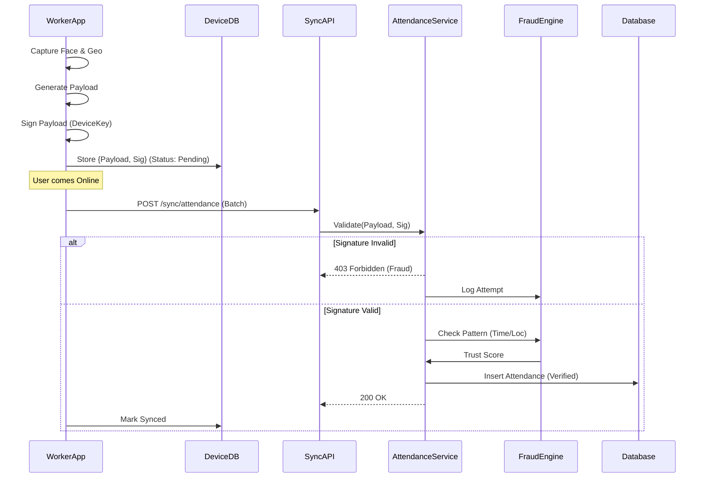

# Version 5: Backend Architecture & Data Flow
**Status**: DRAFT
**Role**: Principal Backend Architect

## 1. Core Architectural Pillars
To meet the "Real World" requirements, we are shifting from a Monolithic MVP to a Modular Service-based Architecture (Logic Separation).

### A. The "Trust Layer" (Security & Auth)
- **Problem**: Simple JWT is insufficient for device tracking and fraud detection.
- **Solution**: Shift to `Session-Based Tokens` with `Device Fingerprinting`.
- **New Components**:
    - `DeviceTrustService`: Evaluates request headers (User-Agent, IP, custom app headers) to calculate a Trust Score (0-100).
    - `TokenManager`: Issues "Offline Signed Tokens" (JWTs with embedded constraints like `siteId`, `timeWindow`, `deviceId`).

### B. The "Offline-First Engine"
- **Problem**: Weak internet causes data loss or "fake" backdated attendance.
- **Solution**: **Cryptographic Attendance Tokens**.
- **Flow**:
    1.  App (Offline) generates `AttendancePacket`.
        -   Payload: `{ workerId, siteId, timestamp, geo }`
        -   Signature: `HMAC_SHA256(Payload + DeviceSecret)`
    2.  App stores in `IndexedDB`.
    3.  Sync Event -> Backend.
    4.  Backend `OfflineSyncService` verifies Signature & Time Window.
    5.  If valid -> Commit to DB. If invalid/replay -> Reject & Log Fraud.

### C. The "Vault" (Compliance)
- **Problem**: Storing raw images on disk violates "Encrypt at rest" requirements for sensitive biometric data.
- **Solution**: **Encrypted Blob Storage**.
- **Implementation**:
    -   Images are encrypted using `AES-256` before writing to `/uploads`.
    -   Keys are managed in environment variables (simulating KMS).
    -   Audit logs track EVERY access to these files.

## 2. Data Flow Diagrams

### Feature: Offline Attendance


### Feature: Assisted Onboarding (Trust Transfer)
`Thekedar` (High Trust) -> creates -> `Worker` (Low Trust)
- Thekedar signs the creation request.
- System inherits Trust Score from Thekedar for the first 30 days.

## 3. Database Schema Extensions (MongoDB)

### `Devices` Collection
Tracks every hardware device used.
```javascript
{
  _id: ObjectId,
  user: ObjectId,
  deviceId: String, // Unique Hash
  fingerprint: {
    os: String,
    model: String,
    simHash: String
  },
  trustScore: Number, // 0-100
  isBlocked: Boolean,
  lastSeen: Date
}
```

### `AttendanceLogs` (Immutable Audit)
```javascript
{
  _id: ObjectId,
  recordHash: String, // SHA256 of critical fields
  prevHash: String,   // Chain for immutability
  data: Object,       // The attendance record
  meta: {
    isOfflineSync: Boolean,
    syncTimestamp: Date,
    deviceTrustScore: Number
  }
}
```

## 4. API Spec Extensions
- `POST /api/v5/sync` (Universal Sync Endpoint)
- `GET /api/v5/vault/:fileId` (Secure, Logged Access)
- `POST /api/v5/device/register` (Handshake)
